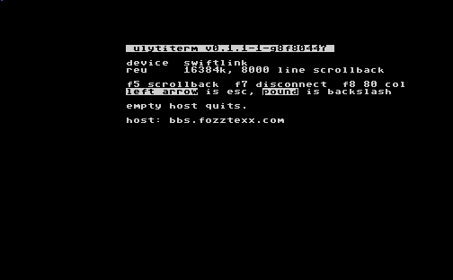

# ulytiterm

VT102/ANSI terminal for the Commodore 64.

Two transports, picked automatically at startup:

- the **Ultimate II+ / Ultimate 64** command interface, which provides real TCP
  sockets, so a host and port are dialled directly;
- a **6551 ACIA** (SwiftLink or Turbo232) at $de00, which is a modem line: the
  host and port become an `ATDT host:port` dial string, which is what the WiFi
  modems in common use expect.

A REU is required either way: it moves the screen with DMA and holds the
scrollback. The Ultimate provides one; enable it, and the command interface,
in the cartridge settings.

Startup checks for a transport, for the REU, and for a network configuration,
and exits to BASIC with a message saying what to enable if anything is
missing. On the Ultimate the cartridge's address, netmask and gateway are
shown before the host prompt.

## Build

`make` builds `ulytiterm.prg` and `ulytiterm.d64`. The only build dependency is
a container runtime: the
[llvm-mos SDK](https://github.com/anarkiwi/docker-mos-llvm-sdk) and `c1541`
(from [asid-vice](https://github.com/anarkiwi/asid-vice)) run from pinned
images. Set `MOS_CC` or `C1541` to use host installs instead.

`make test` runs the terminal, telnet and keyboard unit tests on the host.

`make integration` drives the built disk image inside VICE with
[vice-driver](https://github.com/anarkiwi/vice-driver): a REU and an emulated
SwiftLink wired to a scripted BBS on the host exercise everything except the
Ultimate's own network commands, which need the cartridge. See
[tests/integration](tests/integration).

`python3 tools/demo.py` drives the same setup to recapture the screenshot
above as an animated PNG.

## Use

Run it, enter a host and port, and press return. Telnet is detected
automatically; anything else is treated as a raw stream. On a telnet
connection the terminal announces its type and its window size without being
asked, so a server learns the screen is 40 columns wide even if it never
negotiates; the size is sent again when f8 switches to 80.

| key | action |
| --- | --- |
| f1 - f4 | PF1 - PF4 (`ESC O P` - `ESC O S`) |
| f5 | scrollback (cursor keys to move, any other key exits) |
| f6 | `ESC [ 17 ~` |
| f7 | disconnect |
| f8 | switch between 40 and 80 columns |
| left arrow | escape |
| pound | backslash |
| up arrow | caret, shifted: tilde |
| ctrl + key | control codes |
| C= B, N, P, Q, U | `{`, `}`, `|`, `` ` ``, `_` |

In 80 column mode the 40 column screen is a window that follows the cursor.

## Emulation

VT102 with the common ANSI extensions: scrolling regions, origin mode,
insert/delete line and character, erase display/line/character, tab stops,
autowrap with deferred wrap, save/restore cursor, DECALN, device attributes,
cursor position reports, application cursor keys, DEC special graphics and
16 colour SGR (including the aixterm bright colours and 256 colour requests,
mapped onto the C64 palette). Cell backgrounds are rendered as reverse video,
which is what the VIC-II offers.

The character generator is copied to RAM with the glyphs the C64 font lacks
(`\`, `{`, `}`, `~`, `^`, `` ` ``, and the DEC graphics extras) added.

See [docs/design.md](docs/design.md) for the internals and
[docs/ultimate.md](docs/ultimate.md) for the cartridge interface.
